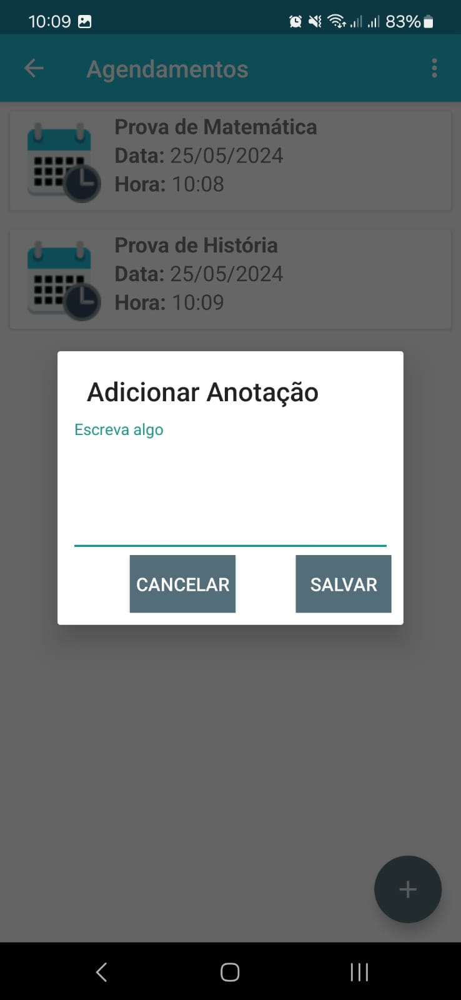

# Boletim

App para acompanhamento do desempenho escolar de estudantes do ensino médio.

É possível registrar as notas dos 4 bimestres do ano, com feedback da situação do aluno em cada disciplina, de acordo com a média escolar e pessoal.

#### Funcionalidades:

* Cadastro / Login do aluno;
* Registro de disciplinas;
* Registro de notas para cada disciplina (Notas Bimestrais);
* Agendamento de provas, com possibilidade de incluir uma anotação;
* Feedback da situação do aluno em cada disciplina, com base na média escolar e pessoal.

#### Screenshots:

|  |  |  |  |
|------------------------------|------------------------------|------------------------------|------------------------------|

|  |  |  |  |
|------------------------------|------------------------------|------------------------------|------------------------------|

|  |  |  |  |
|------------------------------|------------------------------|------------------------------|------------------------------|

|  |  |  |  |
|------------------------------|------------------------------|------------------------------|------------------------------|
